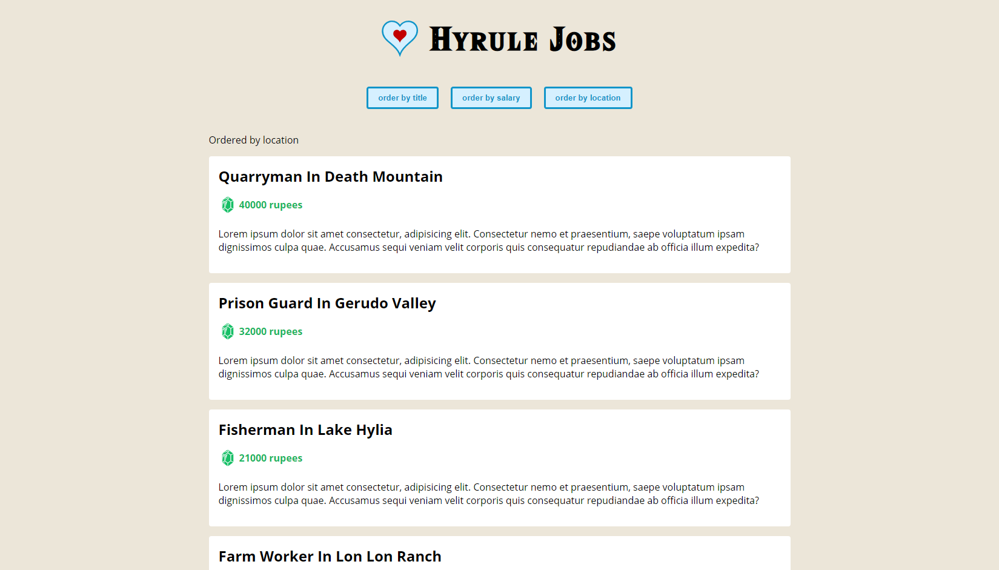

# Hyrule Jobs

A small job board using Vue 3 with TypeScript.

        

## Vetur

Make sure to install [Vetur](https://marketplace.visualstudio.com/items?itemName=octref.vetur) in VS Code.

If your template validation is not working, check these settings are both enabled:

1. Vetur -> Validation -> Interpolation
2. Vetur -> Experimental -> Template Interpolation Service

Based on [Vue 3 with TypeScript Tutorial](https://www.youtube.com/playlist?list=PL4cUxeGkcC9gCtAuEdXTjNVE5bbMFo5OD) by Shaun Pelling - The Net Ninja (2021).
