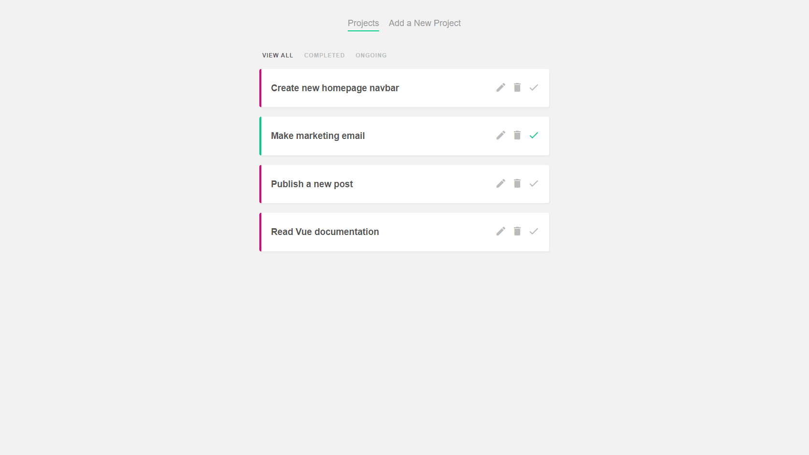

# Project Planner

A simple project tracker to understand Vue basics.

        

## Features

- setting up a project with Vue CLI.
- using the Options API.
- adding, updating, completing and deleting projects.
- creating a filter nav and showing filtered projects.
- displaying Material Icons.

Based on [Build Web Apps with Vue JS 3 & Firebase](https://www.udemy.com/course/build-web-apps-with-vuejs-firebase/) by Shaun Pelling - The Net Ninja (2020).
