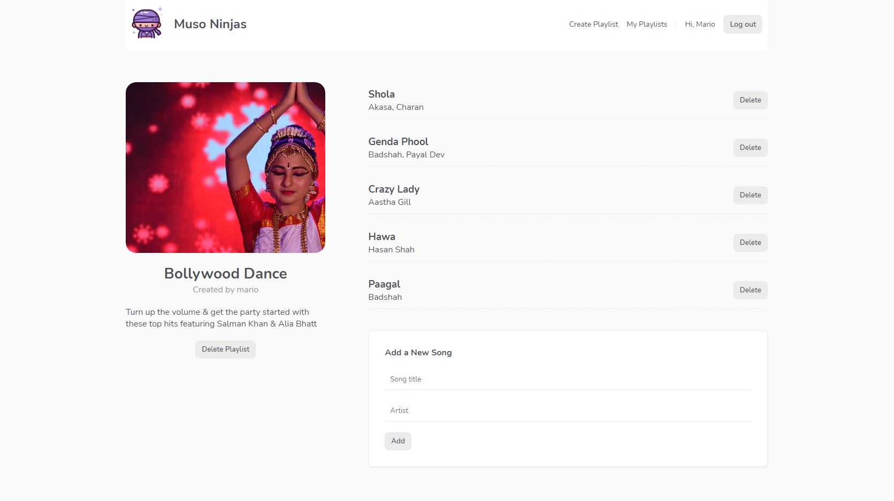

# Muso Ninjas

A music playlist website using Firebase Storage.

## Demo

[See Demo deployed on Firebase](https://vue-muso-ninjas.web.app/)

(Email: demo@demo.com - Password: demouser)

        

## Features

- creating a Firebase project and reusing Firebase composables.
- handling signup and login forms with loading state.
- showing a different navbar for connected users and adding route guards.
- adding new playlists.
- uploading images to Firebase Storage.
- getting real-time playlist data and listing playlists.
- displaying playlists details and checking playlist ownership.
- deleting a playlist and removing images from Firebase Storage.
- adding songs to playlists and updating playlist details.
- listing and deleting songs.
- listing user playlists with Firestore queries.
- building and deploying the app with Firebase CLI.
- adding Firebase Storage security rules to require authentication and locking the API to its domain.

Based on [Build Web Apps with Vue JS 3 & Firebase](https://www.udemy.com/course/build-web-apps-with-vuejs-firebase/) by Shaun Pelling - The Net Ninja (2020).
