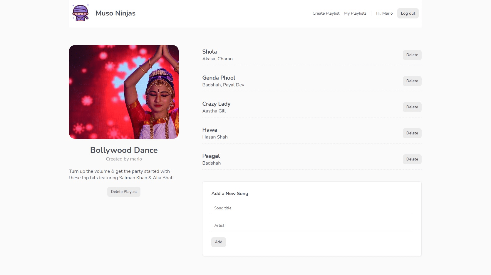

# Vue Projects

This repo is made of 4 projects:

1. [**Project Planner**](#projectplanner): A simple project tracker to understand Vue basics.
2. [**Dojo Blog**](#dojoblog): A blog to learn the Composition API, using Vue Router and Firestore.
3. [**Live Chat**](#livechat): A real-time chatroom working with Firebase Authentication.
4. [**Muso Ninjas**](#musoninjas): A music playlist website using Firebase Storage.

## 1) Project Planner

A simple project tracker to understand Vue basics.

[See 01-project-planner folder](https://github.com/solygambas/vue-projects/tree/main/01-project-planner)

    

### Features

- setting up a project with Vue CLI.
- using the Options API.
- adding, updating, completing and deleting projects.
- creating a filter nav and showing filtered projects.
- displaying Material Icons.

## 2) Dojo Blog

A blog to learn the Composition API, using Vue Router and Firestore.

[See 02-dojo-blog folder](https://github.com/solygambas/vue-projects/tree/main/02-dojo-blog)

    

### Features

- X

## 3) Live Chat

A real-time chatroom working with Firebase Authentication.

[See 03-live-chat folder](https://github.com/solygambas/vue-projects/tree/main/03-live-chat)

### Demo

[See Demo deployed on Firebase](https://vue-projects-54fbf.web.app/)

(Email: demo@demo.com - Password: demouser)

    

### Features

- X

## 4) Muso Ninjas

A music playlist website using Firebase Storage.

[See 04-muso-ninjas folder](https://github.com/solygambas/vue-projects/tree/main/04-muso-ninjas)

### Demo

[See Demo deployed on Firebase](https://vue-muso-ninjas.web.app/)

(Email: demo@demo.com - Password: demouser)

    

### Features

- X

Based on [Build Web Apps with Vue JS 3 & Firebase](https://www.udemy.com/course/build-web-apps-with-vuejs-firebase/) by Shaun Pelling - The Net Ninja (2020).
