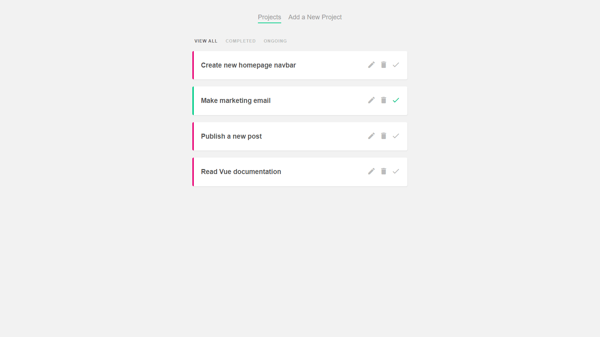

# Vue Projects

4 small Vue projects using Firebase.

| #   | Project                                | Description                                                          |
| --- | -------------------------------------- | -------------------------------------------------------------------- |
| 01  | [**Project Planner**](#projectplanner) | A simple project tracker to understand Vue basics.                   |
| 02  | [**Dojo Blog**](#dojoblog)             | A blog to learn the Composition API, using Vue Router and Firestore. |
| 03  | [**Live Chat**](#livechat)             | A real-time chatroom working with Firebase Authentication.           |
| 04  | [**Muso Ninjas**](#musoninjas)         | A music playlist website using Firebase Storage.                     |

## 1) Project Planner

A simple project tracker to understand Vue basics.

[See 01-project-planner folder](01-project-planner)

    

### Features

- setting up a project with Vue CLI.
- using the Options API.
- adding, updating, completing and deleting projects.
- creating a filter nav and showing filtered projects.
- displaying Material Icons.

## 2) Dojo Blog

A blog to learn the Composition API, using Vue Router and Firestore.

[See 02-dojo-blog folder](02-dojo-blog)

    

### Features

- discovering the Composition API and the setup function.
- using props, refs and computed values.
- using watch, watchEffect and lifecycle hooks.
- creating reusable composition functions (composables).
- fetching data with async/await and making a POST request.
- creating a loading spinner and a tag cloud.
- using useRouter and useRoute from Vue Router.
- connecting to a Firebase project.
- fetching a collection of posts and single posts.
- adding and deleting blog posts.
- using timestamps and ordering posts.
- understanding real-time listeners in Firestore.

## 3) Live Chat

A real-time chatroom working with Firebase Authentication.

[See 03-live-chat folder](03-live-chat)

### Demo

[See Demo deployed on Firebase](https://vue-projects-54fbf.web.app/)

(Email: demo@demo.com - Password: demouser)

    

### Features

- setting up Firebase Authentication.
- handling signup and login forms with composables.
- managing context, errors and emitting events.
- getting the current user and logging users out.
- adding route guards.
- waiting for Firebase Authentication to initialize.
- adding new messages to Firestore.
- using a real-time Firestore listener to handle messages.
- unsubscribing from real-time listeners to avoid unnecessary re-renders.
- formatting dates in the chat window with date-fns.
- building and deploying the app with Firebase CLI.
- adding Firestore security rules to require authentication and locking the API to its domain.

## 4) Muso Ninjas

A music playlist website using Firebase Storage.

[See 04-muso-ninjas folder](04-muso-ninjas)

### Demo

[See Demo deployed on Firebase](https://vue-muso-ninjas.web.app/)

(Email: demo@demo.com - Password: demouser)

    

### Features

- creating a Firebase project and reusing Firebase composables.
- handling signup and login forms with loading state.
- showing a different navbar for connected users and adding route guards.
- adding new playlists.
- uploading images to Firebase Storage.
- getting real-time playlist data and listing playlists.
- displaying playlists details and checking playlist ownership.
- deleting a playlist and removing images from Firebase Storage.
- adding songs to playlists and updating playlist details.
- listing and deleting songs.
- listing user playlists with Firestore queries.
- building and deploying the app with Firebase CLI.
- adding Firebase Storage security rules to require authentication and locking the API to its domain.

Based on [Build Web Apps with Vue JS 3 & Firebase](https://www.udemy.com/course/build-web-apps-with-vuejs-firebase/) by Shaun Pelling - The Net Ninja (2020).
